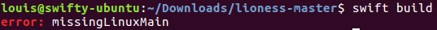
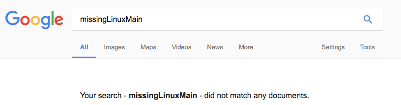

Recently I upgraded my open source projects, including [Lioness](https://github.com/louisdh/lioness), to Swift 4.
What's somewhat special about Lioness is that it supports Linux. Which gave me a rather strange error when upgrading it to Swift 4: `missingLinuxMain`.

*(The `swift build` command is ran by Travis-CI on each commit to make sure Lioness still compiles as a Swift package on Linux.)*

The weird thing is that the `swift build` command worked fine with Swift 3. As I'm sure most developers would do, the first thing I tried is to Google this error. But that gave me the following disappointing result:

Appearantly no-one had ever put anything about this error on the internet. So I decided I would, with the blog post you're reading as a result.

## The solution
Starting with Swift 4, it is expected that you have a `LinuxMain.swift` file in the `Tests` folder of your Swift package. This file is intended to include the unit tests you want to run on Linux for your Swift package. I didn't run the unit tests of Lioness on Linux at the time of writing, which is why I never bothered adding it. To be clear: the `LinuxMain.swift` file may be empty, but it's required to exist if you want the Swift Package Manager commands to work.

---
If you would like to get notified about new posts, you can:

* Follow [@SilverFoxBE](https://twitter.com/SilverFoxBE) on Twitter
* Subscribe to the [RSS feed](http://silverfox.be/silverfox-rss.xml)