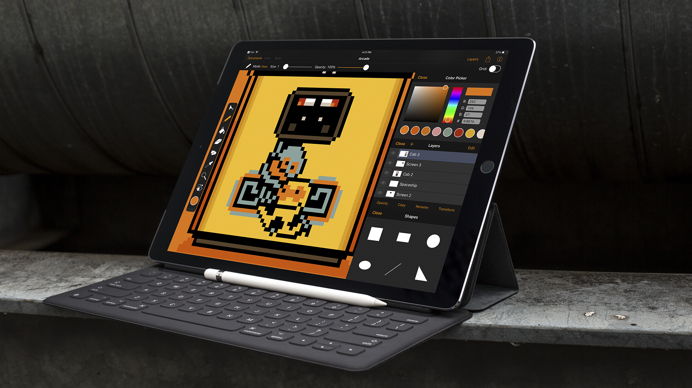

After many months of work and teasing on Twitter, [Pixure 3 is finally here](https://itunes.apple.com/us/app/pixure-professional-pixel-art-studio/id893400841?ls=1&mt=8). It truly is the best way to draw pixel art on iPad and iPhone.

Large portions of the app have been rewritten in Swift to prepare Pixure for some awesome features that are coming in future updates. But that didn’t stop me from adding some big new features in this release:

## PanelKit 2.0
As [announced last week](https://silverfox.be/articles/2017-12-05-panelkit2.html), PanelKit 2.0 is a huge update.
PanelKit was designed with Pixure in mind, so naturally Pixure 3 takes full advantage of all the new PanelKit 2.0 features. By default now, the color and layers panel are pinned when opening a document. The layers panel can be resized. And now the panel states are also preserved when closing a document, or even relaunching the app.
The color picker, draw modes and shapes panels are now also PanelKit compatible.

## Version browser
I teased [a document version browser](https://twitter.com/LouisDhauwe/status/858767427815047169) some time ago on Twitter. I'm really excited that it's included in Pixure 3. Versions are created automatically, and you can export any version you want.

## Advanced export
The process of creating great pixel art doesn't stop at the last pixel. Exporting is very important. Pixure 3 introduces an advanced exporter, allowing you to export to PNG, JPG, SVG or PSD, at any scale. There's now also an option to export with, or without, transparency.

## iOS 11
Pixure 3 requires iOS 11. This allowed for the use of some great new APIs, including drag and drop. Now you can drag documents from the grid (e.g. to the Files app) and drag layers to reorder them.

## The small things
* Improved app settings layout
* Improved tool settings layout
* Improved document opening
* Optimized for iPhone X
* Removed watchOS extension
* Updated icons
* New keyboard shortcuts
* Better circle and ellipse drawing tools
 
---
If you would like to get notified about new posts, you can:

* Follow [@SilverFoxBE](https://twitter.com/SilverFoxBE) on Twitter
* Subscribe to the [RSS feed](http://silverfox.be/silverfox-rss.xml)